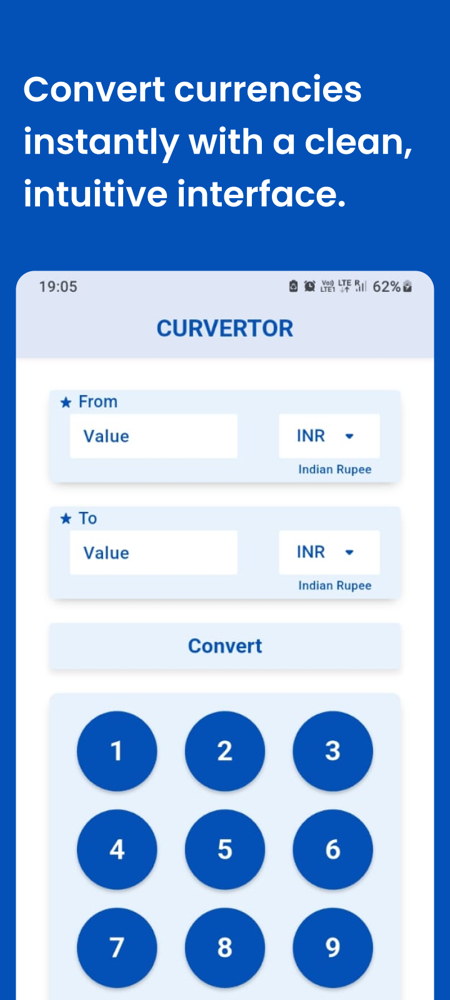
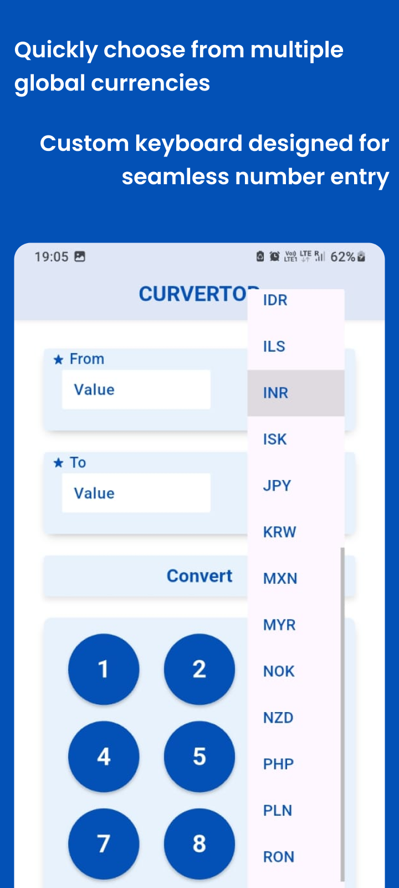

# 💱 Curvertor - Currency Converter App
<p align="center">
  
</p>

**Curvertor** is my **first Flutter application**, combining **clean UI design** and **core Flutter development concepts**.  
The project focuses on building a smooth currency conversion experience while showcasing my ability to design in **Figma** and implement it using **Flutter**.

## ✨ Features

- Convert between multiple international currencies  
- Fast and accurate exchange rate calculation  
- Clean & minimal UI designed in **Figma**  
- Responsive layout for different screen sizes  
- Real-time conversion updates

## 🛠 Tech Stack

- **Flutter (Dart)** – App Development  
- **REST API** – Live currency exchange rates  
- **Figma** – UI/UX Design  
- **Material UI** – Consistent design system
## 📸 App Screenshots
<p>
  
  
  
</p>

## 🚀 Getting Started

### Prerequisites
- Flutter SDK installed
- Android Studio / VS Code
- Emulator or physical device

### Installation

```bash
git clone https://github.com/jagrati7305/currency_convertor
cd currency_convertor
flutter pub get
flutter run
